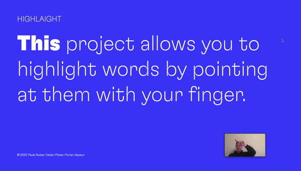

# HIGHLAIGHT

This project allows you to highlight words by pointing at them with your finger.

Check out our [Project-Page](https://floriankapaun.github.io/workshop-hsa/) on Github or over [here](https://highlaight.florian-kapaun.de/).

Created by Fabian Pitzer, Paula Nuber and Florian Kapaun as part of the Iconstorm workshop "Vom Aah zum Wow" to explore and demonstrate some possibilities of machine learning and variable fonts in the modern web.
